# Data Ingestor Platform - Master Architecture Compendium

## Scope and sources
- Curated from: all_diagrams.md, architecture-deep-dive.md, backend-system-design-plan.md, master_class_diagram.md, part2.md, part3.md, part4.md, part5.md, scalable-architecture-master-plan.md, target-architecture-diagrams.md, back/README.md.
- Skipped: minio-metastore-plan.md and any metastore-only document per request.
- This document separates Current MVP (as-is) from Target Architecture (planned) to avoid mixing behaviors.

## Legend
- Current MVP: running behavior today with pipelines.json, static Airflow DAG files, and local Spark execution inside Airflow workers.
- Target Architecture: planned DDD refactor with dynamic DAGs, connector plugins, late-binding secrets, and Spark on Kubernetes.

## System overview
The platform is split across three planes plus a user-facing UI:
- User interface: React frontend for pipeline, notebook, and monitoring workflows.
- Control plane: NestJS API that owns state, validation, and orchestration abstractions.
- Orchestration plane: Airflow scheduler that triggers runs and monitors execution.
- Data plane: Spark execution environment that extracts data and writes Delta files.
- Storage: source databases and a Delta Lake in S3/MinIO.

### Macro system architecture (target macro)
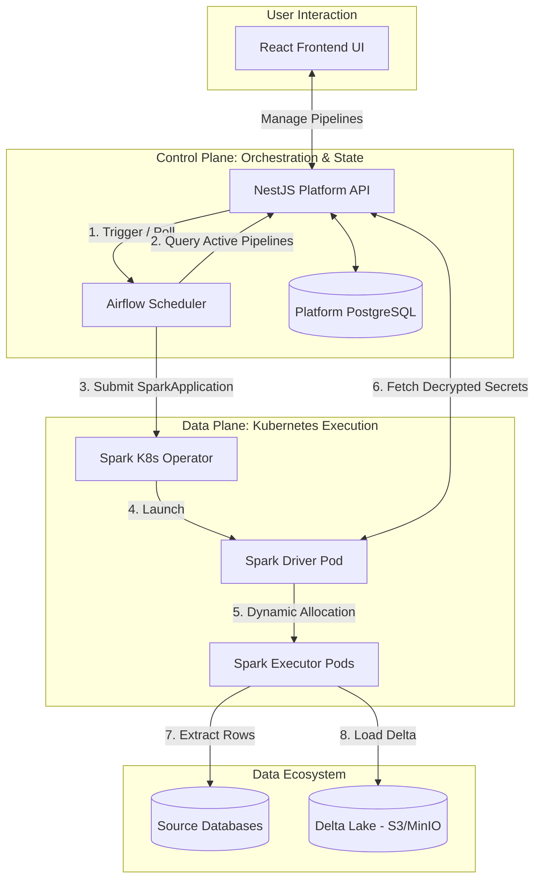

## Repository structure (top-level and key subtrees)
```text
dataingestor/
  all_diagrams.md
  architecture-deep-dive.md
  backend-system-design-plan.md
  master_class_diagram.md
  part2.md
  part3.md
  part4.md
  part5.md
  scalable-architecture-master-plan.md
  target-architecture-diagrams.md
  airflow/
    dags/
      dynamic_dag_builder.py
      main.py
      spark_ingest.py
      ingest_*.py
  airflow_spark_delta/
    docker-compose.yml
    Dockerfile
    Dockerfile.kernel-gateway
    delta/
    spark/
      jobs/
  back/
    README.md
    src/
      airflow/
      alerts/
      catalog/
      compute-profiles/
      connections/
      database/
      execution/
      health/
      ingestion/
      logs/
      notebook-database/
      notebooks/
      pipelines/
      schedules/
      sources/
  front/
    index.html
    vite.config.js
    src/
      api/
      components/
      hooks/
      pages/
      styles/
  delta/
  docs/
```

## Current MVP architecture (as-is)

### Runtime boundaries and external dependencies
- Airflow REST API for DAGs, runs, and logs.
- Postgres source database for schema discovery and data preview.
- Postgres notebooks database for notebook and compute profile state.
- MinIO/S3 for Delta Lake storage.
- Local filesystem for pipelines.json, Airflow DAG files, and Spark job configs.
- Jupyter Kernel Gateway for notebook execution.

### Module dependency graph (current MVP)
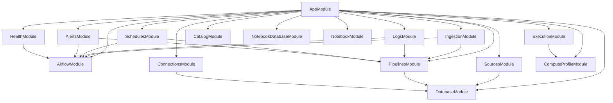

### Service class diagram (current MVP)
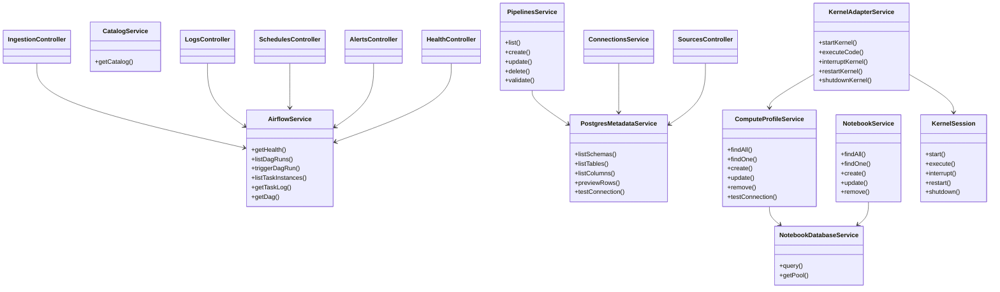

### Service responsibilities (current MVP)
- AirflowService: DAG metadata, runs, task instances, and logs via Airflow REST; supports auth modes; retries retryable errors and normalizes failures.
- PostgresMetadataService: source DB schema, table, column metadata and preview rows; owns PG pool lifecycle; validates identifiers to prevent SQL injection.
- PipelinesService: CRUD and validation; writes pipelines.json, Airflow DAG files, and Spark job config JSON; validates against PostgresMetadataService; migrates legacy destination paths on module init.
- CatalogService: reads Delta Lake catalogs from filesystem or S3/MinIO; parses _delta_log JSON and aggregates table stats.
- ConnectionsService: displays/tests/stores Postgres connection settings; writes .env on success; uses PostgresMetadataService for connectivity testing.
- NotebookDatabaseService: global provider for notebooks DB pool; initializes tables on startup.
- NotebookService: CRUD for notebooks; validates compute_profile_id exists in compute_profiles.
- ComputeProfileService: CRUD and connectivity tests; calls Kernel Gateway /api/kernelspecs and updates status.
- KernelAdapterService: manages KernelSession per notebook; handles lifecycle, idle timeout, and routing of execute/interrupt/restart/shutdown.
- KernelSession: direct Kernel Gateway REST + WS client; translates Jupyter protocol to simplified execution events.

### API surface (current MVP)
All endpoints return JSON. Validation errors return 400. Airflow failures return 502 with a message.

#### Health
- GET /health
  - Checks Airflow API reachability.

#### Connections (Postgres source)
- GET /connections
  - Returns current Postgres connection with masked password.
- GET /connections/test
  - Tests the configured Postgres connection.
- POST /connections/postgres
  - Tests and persists Postgres credentials into .env.

#### Source discovery
- GET /sources/schemas
  - Returns available schemas.
- GET /sources/tables?schema=public&includeViews=true
  - Returns tables and views for a schema.
- GET /sources/tables/:table/columns?schema=public
  - Returns column metadata with types and primary key info.
- GET /sources/tables/:table/preview?schema=public&limit=20&columns=col1,col2
  - Returns preview rows.

#### Pipelines
Pipeline object shape:
```
{
  "id": "uuid",
  "name": "Orders incremental",
  "description": "Optional description",
  "createdAt": "2026-05-08T10:00:00.000Z",
  "updatedAt": "2026-05-08T10:00:00.000Z",
  "source": {
    "schema": "public",
    "table": "orders",
    "columns": ["id", "updated_at", "total"]
  },
  "ingestion": {
    "mode": "incremental",
    "watermarkColumn": "updated_at"
  },
  "destination": {
    "path": "../delta/orders_incremental",
    "mode": "append"
  },
  "schedule": {
    "cron": "0 * * * *"
  },
  "dag": {
    "dagId": "ingest_orders_incremental_ab12cd34",
    "filePath": "../airflow/dags/ingest_orders_incremental_ab12cd34.py"
  }
}
```

- GET /pipelines
- POST /pipelines
  - Validates schema and writes DAG and Spark job config files.
- POST /pipelines/validate
  - Validates a pipeline payload without persisting.
- GET /pipelines/:pipelineId
- PUT /pipelines/:pipelineId
- DELETE /pipelines/:pipelineId
  - Also removes the DAG file.

#### Schedules
- GET /schedules
  - Optionally accepts pipelineId to return a specific schedule.

#### Alerts
- GET /alerts
  - Optionally accepts pipelineId to compute alert level for a pipeline.

#### Ingestion runs (global DAG)
These endpoints use AIRFLOW_DAG_ID.
- GET /ingestion/runs
- POST /ingestion/runs
- GET /ingestion/runs/:runId
- GET /ingestion/runs/:runId/tasks

#### Ingestion runs (pipeline-specific)
These endpoints use per-pipeline DAG IDs.
- GET /ingestion/pipelines/:pipelineId/runs
- POST /ingestion/pipelines/:pipelineId/runs
- GET /ingestion/pipelines/:pipelineId/runs/:runId
- GET /ingestion/pipelines/:pipelineId/runs/:runId/tasks

#### Logs
- GET /logs/runs/:runId/tasks/:taskId?tryNumber=1
- GET /logs/pipelines/:pipelineId/runs/:runId/tasks/:taskId?tryNumber=1

#### Notebooks
- GET /notebooks
- GET /notebooks/:id
- POST /notebooks
- PUT /notebooks/:id
- DELETE /notebooks/:id

#### Compute profiles
- GET /compute-profiles
- GET /compute-profiles/:id
- POST /compute-profiles
- PUT /compute-profiles/:id
- DELETE /compute-profiles/:id
- POST /compute-profiles/:id/test

#### Notebook execution (WebSocket)
- ExecutionGateway routes kernel:start and cell:execute events to KernelAdapterService.

### State and file side effects (current MVP)
- Pipeline definitions stored in a JSON file (PIPELINES_FILE).
- Airflow DAG Python files written into AIRFLOW_DAGS_DIR.
- Spark job config JSON written into AIRFLOW_SPARK_JOBS_DIR.
- Postgres connection settings persisted into .env by ConnectionsService.
- Delta Lake paths use DELTA_BASE_PATH as default root.

### Current orchestration and execution
- Airflow runs per-pipeline DAGs generated by the backend.
- Spark ingestion runs inside the Airflow worker container via spark_ingest.py.
- Source DB credentials are injected as environment variables into Airflow tasks.

### Current behavioral sequences
#### Create pipeline (current MVP)
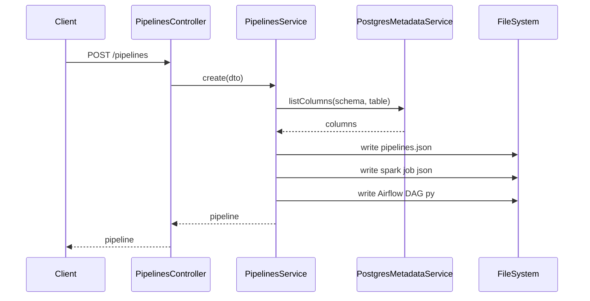

#### Trigger pipeline run (current MVP)
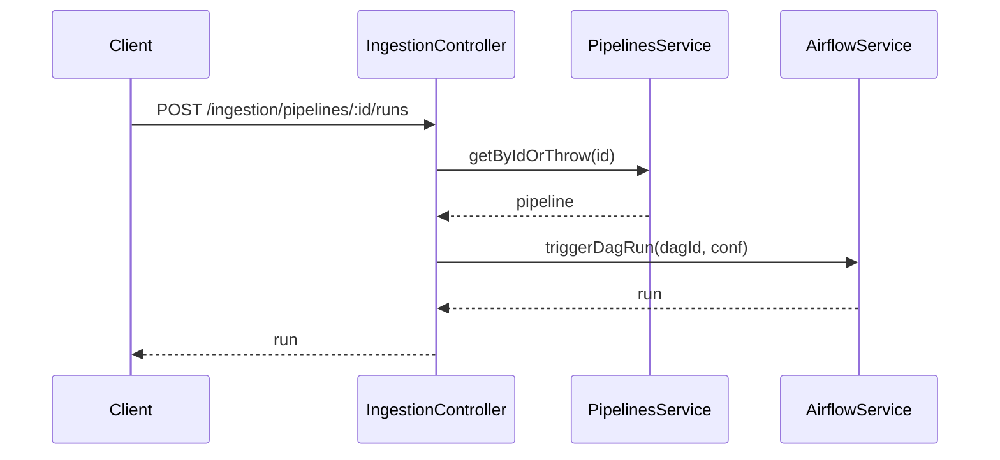

#### Notebook execution (current MVP)
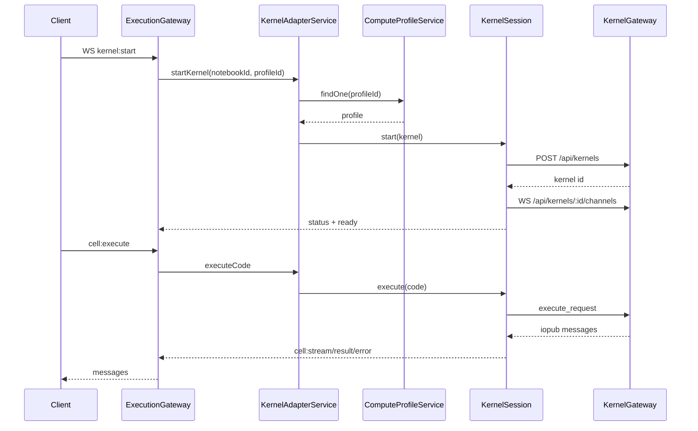

## Target architecture (planned DDD refactor)

### Objectives
- Polymorphic data sources via a connector plugin system.
- Domain-driven layout with clear separation of core, connectors, orchestration, and features.
- Dynamic DAG generation instead of filesystem writes.
- Late-binding configuration with zero-trust credentials at runtime.
- Distributed Spark on Kubernetes with dynamic allocation.

### DDD directory layout (target)
```text
back/src/
  core/
    config/
    platform-database/
    crypto/
  orchestration/
    interfaces/
    providers/
      airflow/
  connectors/
    connector.registry.ts
    interfaces/
    plugins/
      postgres/
      salesforce/
  features/
    connections/
    pipelines/
    metastore/
    workspace/
```

### Module dependency graph (target DDD)
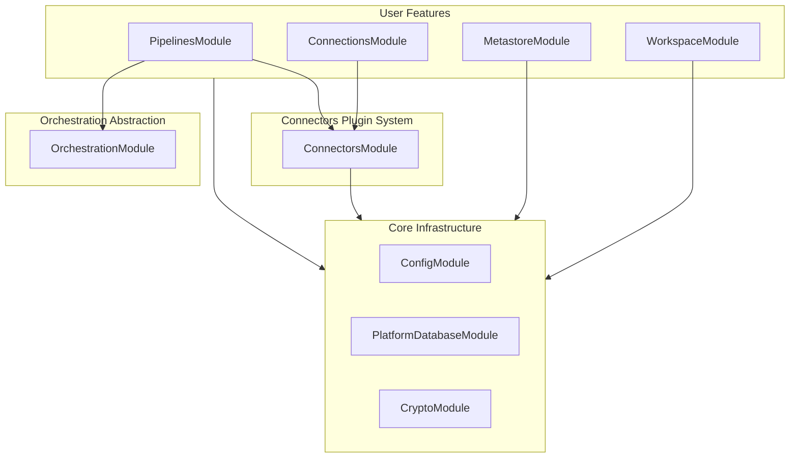

### Control plane class diagram (target DDD)
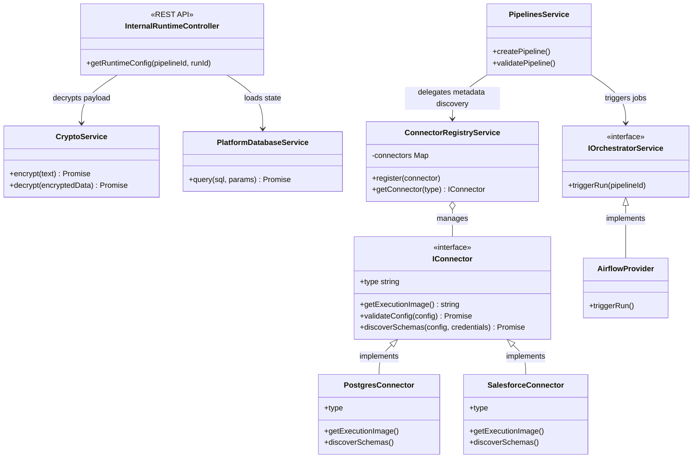

### Core domain class diagram (typed signatures)
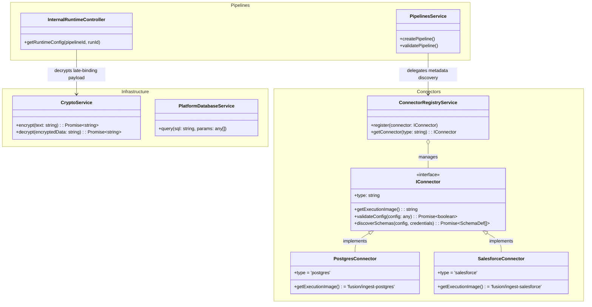

### Connector framework (target)
- IConnector defines: type, getExecutionImage, validateConfig, testConnection, discoverSchemas, discoverColumns, previewData.
- ConnectorRegistryService registers plugins and returns the correct connector by type.
- PipelinesService validates pipeline schemas via connector metadata discovery.
- Airflow receives a per-connector execution image from the registry.

### Orchestration abstraction (target)
- IOrchestratorService defines triggerRun and other orchestration operations.
- AirflowProvider implements the interface and hides Airflow REST details.

### Internal runtime API and late binding (target)
- GET /internal/pipelines/active returns active pipelines with cron and execution image.
- Runtime config endpoint appears in design docs in two variants: GET /internal/pipelines/{pipelineId}/runtime-config with optional runId query, and GET /internal/pipelines/{runId}/runtime-config. Normalize to a single path in implementation to avoid ambiguity.
- CryptoService decrypts connector and storage credentials just-in-time.
- Access is protected by an internal API key or network boundary.

### Dynamic Airflow DAG factory (target)
- A single Airflow script builds DAGs in memory by polling active pipelines.
- Each DAG uses SparkKubernetesOperator with a SparkApplication spec.
- The driver pod receives INTERNAL_API_URL and INTERNAL_API_KEY to fetch late-binding config.
- Dynamic allocation is enabled to scale executors based on workload.

### Target execution flow example (Salesforce incremental ingestion)
1. Airflow parses dynamic_dag_builder.py and fetches active pipelines.
2. Airflow generates an in-memory DAG for the Salesforce pipeline.
3. Cron triggers a DAG run; Airflow submits a SparkApplication to the cluster.
4. Spark Driver pod starts and calls the internal runtime-config endpoint.
5. NestJS decrypts OAuth and S3 credentials and returns runtime config.
6. Spark Driver requests more executors based on data volume.
7. Executors complete tasks, scale down, and the driver exits cleanly.

### Data plane class diagram (target)
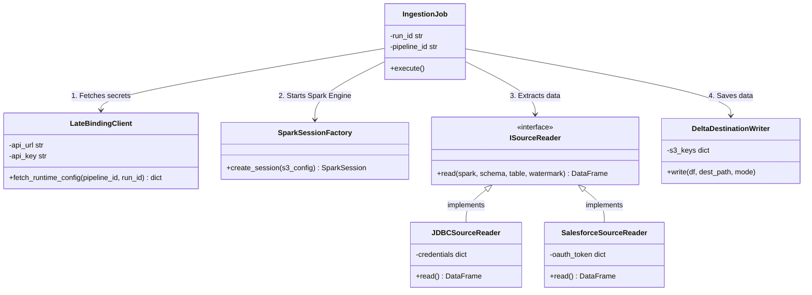

### Workspace and notebook execution class diagram (target)
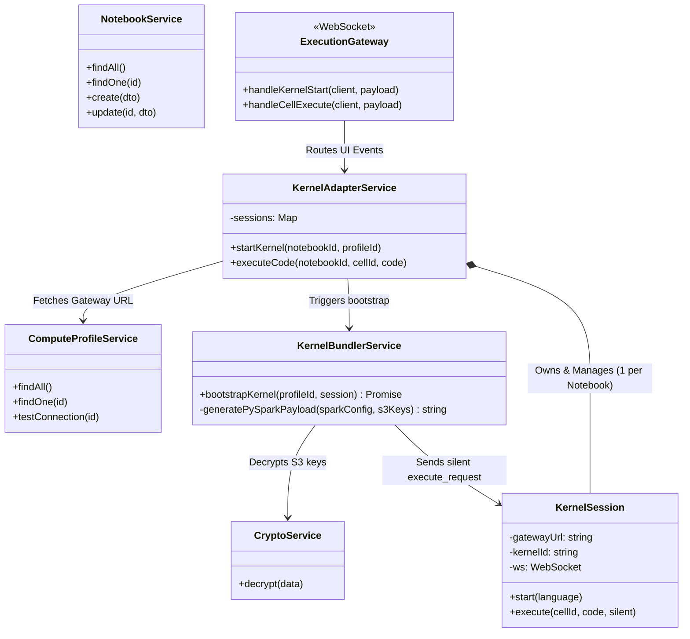

### Target behavioral sequences
#### End-to-end execution sequence
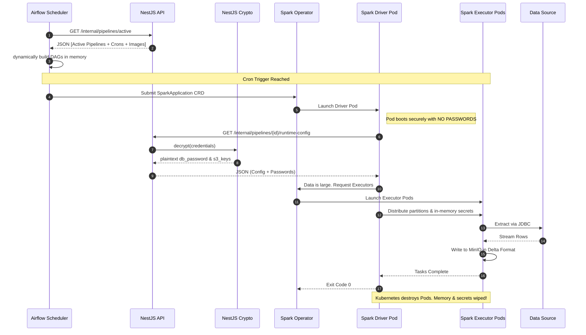

#### Pipeline creation and validation (target)
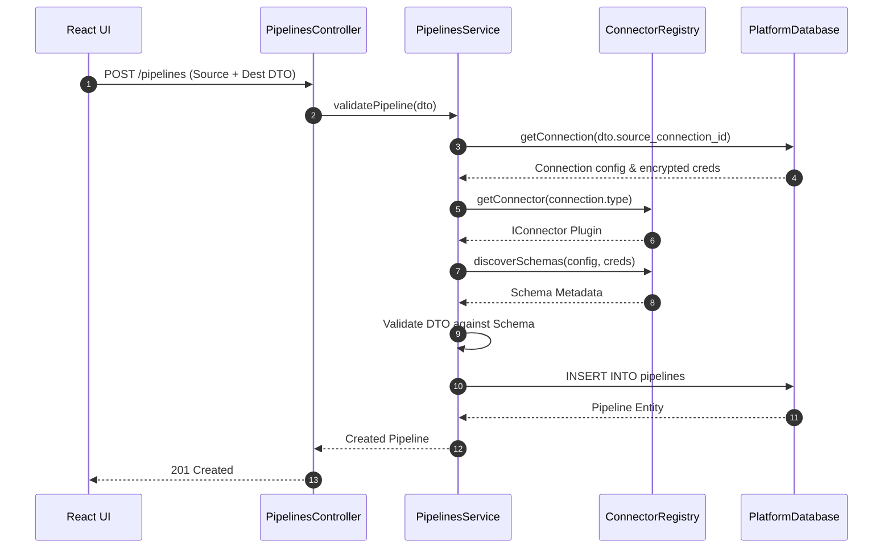

#### Notebook and kernel execution (target)
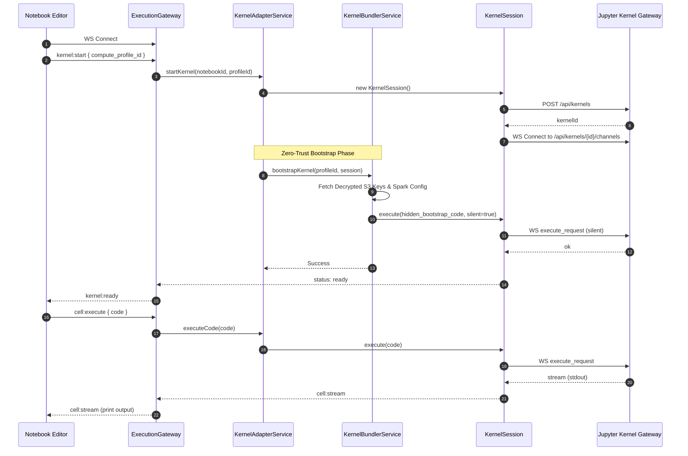

### Master system class diagram (cross-plane)
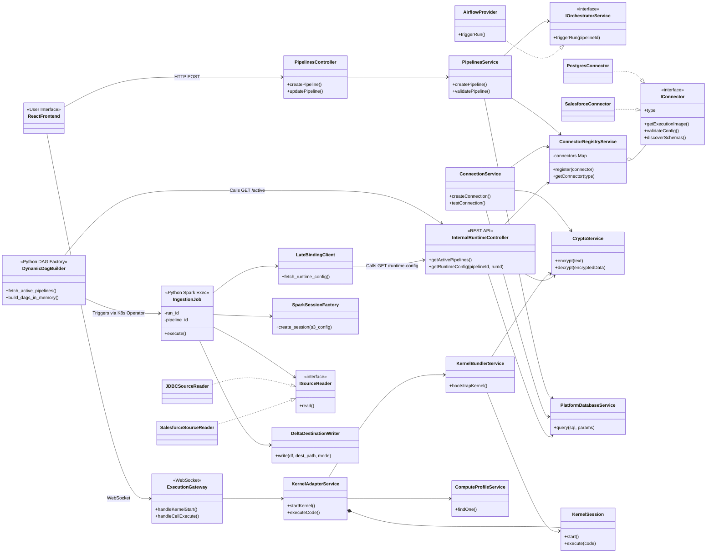

## Data model (target)
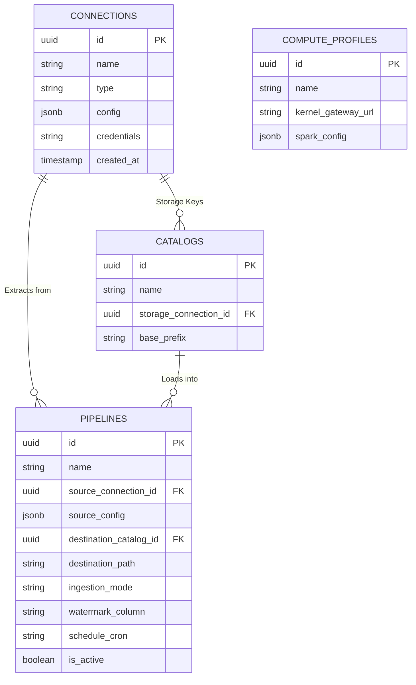

## Use case diagrams

### User-facing use cases
```mermaid
usecaseDiagram
  actor "Data Engineer" as DE
  actor "Data Analyst" as DA
  actor "Admin" as ADM

  rectangle "Data Ingestor Platform" {
    (Configure Connection) as UC1
    (Test Connection) as UC2
    (Discover Schemas and Tables) as UC3
    (Create Pipeline) as UC4
    (Validate Pipeline) as UC5
    (Schedule Pipeline) as UC6
    (Trigger Ingestion Run) as UC7
    (Monitor Runs) as UC8
    (View Logs) as UC9
    (Manage Alerts) as UC10
    (Manage Compute Profiles) as UC11
    (Create Notebook) as UC12
    (Execute Notebook Cells) as UC13
  }

  DE --> UC1
  DE --> UC2
  DE --> UC3
  DE --> UC4
  DE --> UC5
  DE --> UC6
  DE --> UC7
  DE --> UC8
  DE --> UC9

  DA --> UC12
  DA --> UC13
  DA --> UC8
  DA --> UC9

  ADM --> UC1
  ADM --> UC2
  ADM --> UC6
  ADM --> UC10
  ADM --> UC11
```

### System interaction use cases
```mermaid
usecaseDiagram
  actor "Airflow Scheduler" as Airflow
  actor "Spark Driver Pod" as Driver

  rectangle "Control Plane (NestJS Internal API)" {
    (List Active Pipelines) as UC1
    (Fetch Runtime Config) as UC2
  }

  Airflow --> UC1
  Driver --> UC2
```

## Implementation plan and phases

### Phase 1: Foundation and infrastructure overhaul
- Move notebook-database to core/platform-database.
- Move config to core/config.
- Rename catalog to features/metastore.
- Move notebooks, compute-profiles, execution under features/workspace.
- Add core/crypto/crypto.service.ts with AES-256-GCM.
- Add tests for CryptoService.
- Add platform database migrations for connections and pipelines tables.

### Phase 2: Connector framework (plugin system)
- Create connectors/interfaces/connector.interface.ts.
- Implement ConnectorRegistryService as a type-to-plugin map.
- Migrate Postgres logic into connectors/plugins/postgres/postgres.connector.ts.
- Update connections and sources features to use registry instead of hardcoded Postgres services.

### Phase 3: Dynamic pipeline state and API migration
- Store pipelines in the database instead of pipelines.json.
- Validate pipelines via connector.discoverSchemas.
- Remove writeDagFile and writeSparkConfigFile from PipelinesService.

### Phase 4: Dynamic orchestration and late-binding API
- Add features/pipelines/internal.controller.ts with runtime-config endpoint.
- Secure internal endpoints with an API key or network boundary.
- Move Airflow provider under orchestration/providers/airflow and implement interface.
- Replace static DAG generation with dynamic_dag_builder.py polling.

### Phase 5: Decoupled containerized execution
- Install Spark Operator in the cluster.
- Use SparkKubernetesOperator for SparkApplication submission.
- Build per-connector ingestion images (ingest-postgres, ingest-salesforce, ingest-sap).
- Spark Driver fetches runtime-config and scales executors dynamically.

## Migration and rollout strategy
1. Structural safe refactor (Phase 1) with no behavior change.
2. Dual-write pipelines (DB + legacy files) to keep Airflow stable.
3. Switchover to dynamic DAGs and Spark Operator, then remove legacy DAG generation.

## Risks and mitigations
- High load from Airflow polling NestJS too frequently.
  - Mitigate with caching and a fast /pipelines/active endpoint.
- Internal runtime API exposure.
  - Mitigate with internal API key or one-time JWT/nonce.
- Connector dependency bloat.
  - Mitigate with per-connector images and strict registry enforcement.

## Operational runbook (current MVP)

### Environment variables
| Key | Purpose | Default / Example |
| --- | --- | --- |
| APP_PORT | NestJS listen port | 3001 |
| AIRFLOW_BASE_URL | Airflow REST API base | http://localhost:8080 |
| AIRFLOW_DAG_ID | Default DAG id | ingest_postgres_to_delta |
| AIRFLOW_AUTH_TYPE | Auth type (none/basic/bearer) | basic |
| AIRFLOW_USERNAME | Airflow username | admin |
| AIRFLOW_PASSWORD | Airflow password | admin |
| AIRFLOW_TOKEN | Bearer token | empty |
| AIRFLOW_TIMEOUT_MS | Airflow request timeout | 10000 |
| AIRFLOW_DAGS_DIR | Airflow DAG output folder | ../airflow/dags |
| PGHOST | Source Postgres host | localhost |
| PGPORT | Source Postgres port | 5432 |
| PGDATABASE | Source Postgres DB | example_db |
| PGUSER | Source Postgres user | postgres |
| PGPASSWORD | Source Postgres password | postgres |
| PIPELINES_FILE | Pipeline JSON store | ./data/pipelines.json |
| PREVIEW_ROW_LIMIT | Row preview limit | 20 |
| DELTA_BASE_PATH | Delta base path | ../delta |

### Local backend
- cd back
- npm install
- npm run start:dev

### Local Airflow + Spark (docker compose)
- cd airflow_spark_delta
- AIRFLOW_UID=$(id -u) AIRFLOW_GID=0 docker compose up -d
- Airflow UI: http://localhost:8080 (admin/admin)
- Compose includes postgres-source for schema discovery and ingestion.

### Security posture (current vs target)
- Current MVP: source DB credentials are injected into Airflow tasks via env vars.
- Target: credentials are never stored in Airflow, and are late-bound in memory via internal runtime-config.
