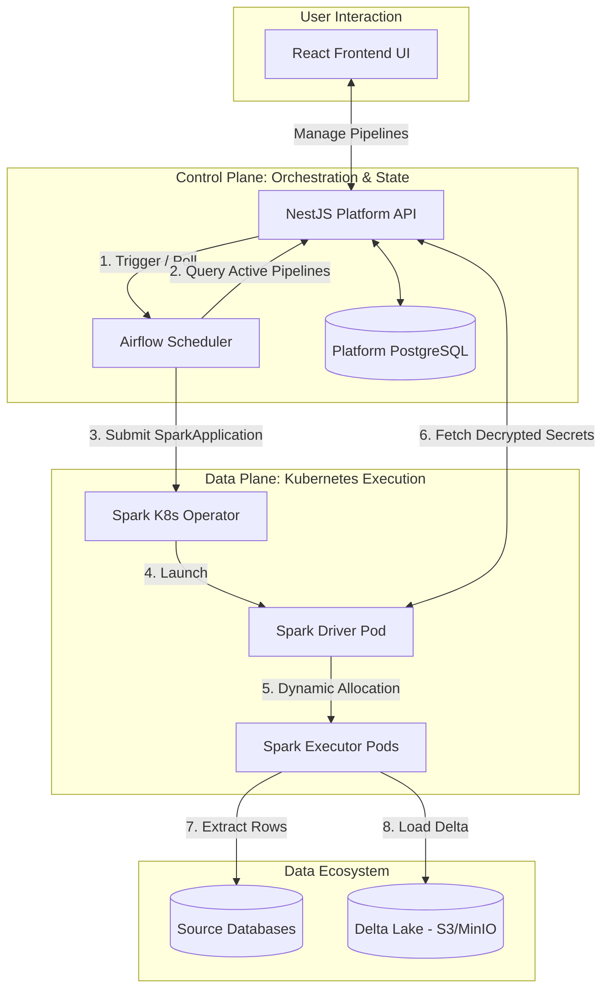
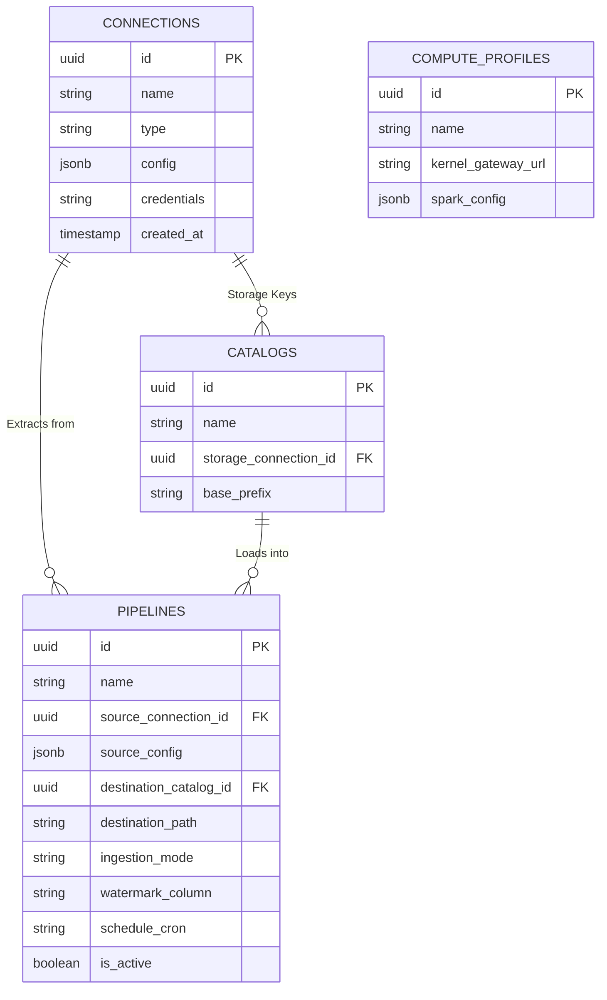

# Enterprise Data Platform: System Diagrams

This document contains the complete set of architectural diagrams for the scalable, Domain-Driven data ingestion platform.

---

## Part 1: High-Level Architecture & State

### 1. Macro System Architecture

This flowchart illustrates the highest level of the platform. It separates the "Manager" (Control Plane) from the "Workers" (Data Plane) and maps out the complete interaction flow from the User UI down to the Data Ecosystem.

---

### 2. Platform Database ERD (Entity-Relationship Diagram)

This diagram maps out the internal state managed by the NestJS Control Plane. The polymorphic `jsonb` fields allow the platform to support any type of data source without altering the database schema.

