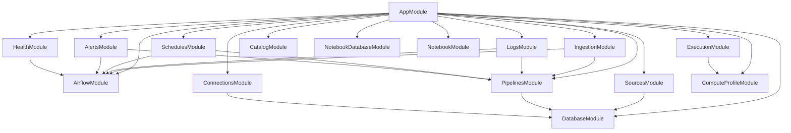
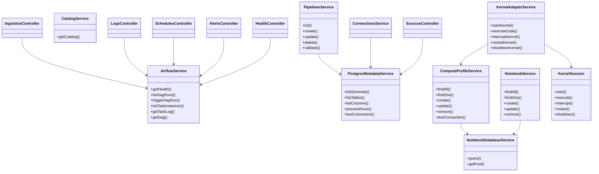
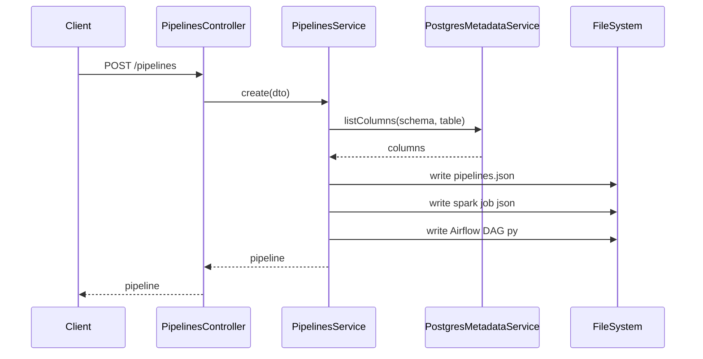
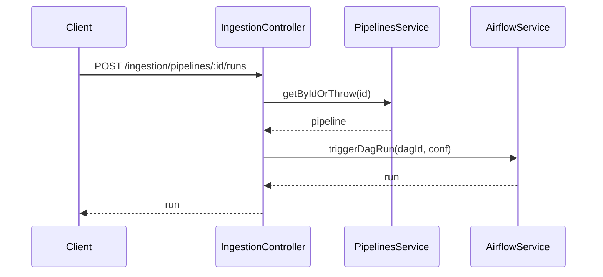
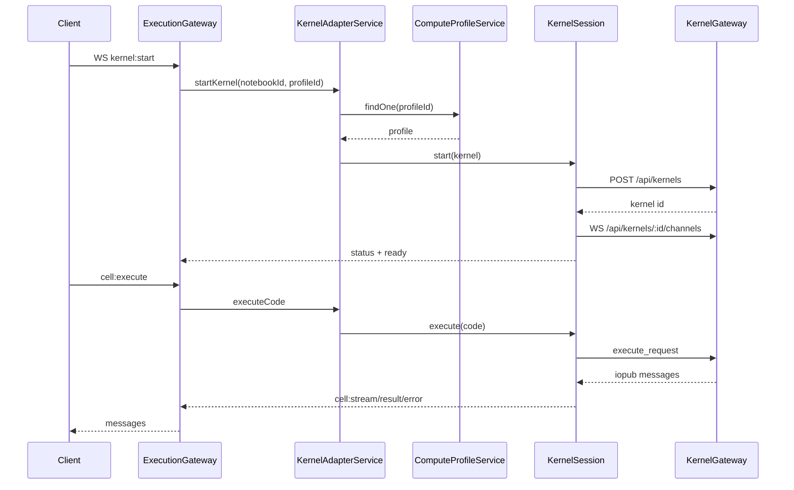

# Backend System Design Plan

## Goal
Produce a detailed system design report of the backend, covering every module, controller, and service, how they interact, and who depends on whom. Include diagrams (component/module, class, and sequence) using Mermaid.

## Scope and Inputs
- Codebase: back/ (NestJS)
- Focus: modules, controllers, services, database and external integrations
- Exclusions: front/ UI and Airflow/Spark runtime code unless referenced by backend services

## High-Level Architecture Summary
- Framework: NestJS app with REST endpoints and a WebSocket gateway.
- Config: global ConfigModule with env validation.
- External systems:
  - Airflow REST API (DAGs, runs, task logs)
  - Postgres (source metadata DB)
  - Postgres (notebooks DB)
  - MinIO/S3 (Delta Lake catalog via s3a)
  - Local filesystem (pipelines.json, Airflow DAGs, Spark job configs)
  - Jupyter Kernel Gateway (WebSocket + REST for kernels)

## Module Map (Ownership and Dependencies)
- AppModule
  - Imports all feature modules.
- AirflowModule
  - Providers: AirflowService
  - External dependency: Airflow REST API
- DatabaseModule
  - Providers: PostgresMetadataService
  - External dependency: Postgres source DB
- SourcesModule
  - Controllers: SourcesController
  - Depends on: DatabaseModule
- PipelinesModule
  - Controllers: PipelinesController
  - Providers: PipelinesService
  - Depends on: DatabaseModule, ConfigModule
- IngestionModule
  - Controllers: IngestionController
  - Depends on: AirflowModule, PipelinesModule
- LogsModule
  - Controllers: LogsController
  - Depends on: AirflowModule, PipelinesModule
- SchedulesModule
  - Controllers: SchedulesController
  - Depends on: AirflowModule, PipelinesModule
- AlertsModule
  - Controllers: AlertsController
  - Depends on: AirflowModule, PipelinesModule
- HealthModule
  - Controllers: HealthController
  - Depends on: AirflowModule
- CatalogModule
  - Controllers: CatalogController
  - Providers: CatalogService
  - External dependency: local filesystem or MinIO/S3
- NotebookDatabaseModule (Global)
  - Providers: NotebookDatabaseService
  - External dependency: notebooks Postgres DB
- ComputeProfileModule
  - Controllers: ComputeProfileController
  - Providers: ComputeProfileService
  - Depends on: NotebookDatabaseModule, ConfigModule
- NotebookModule
  - Controllers: NotebookController
  - Providers: NotebookService
  - Depends on: NotebookDatabaseModule
- ExecutionModule
  - Providers: ExecutionGateway, KernelAdapterService
  - Depends on: ComputeProfileModule

## Controllers and Endpoints
### AlertsController (alerts)
- GET /alerts
  - Uses AirflowService listDagRuns.
  - Optional pipelineId: PipelinesService.getByIdOrThrow.
  - Computes alertLevel based on failed runs.

### CatalogController (catalog)
- GET /catalog
  - Uses CatalogService.getCatalog (filesystem or S3).

### ConnectionsController (connections)
- GET /connections
  - Uses ConnectionsService.getPostgresConnection.
- GET /connections/test
  - Uses ConnectionsService.testPostgresConnection.
- POST /connections/postgres
  - Uses ConnectionsService.setupPostgresConnection and persists to .env.

### ComputeProfileController (compute-profiles)
- GET /compute-profiles
- GET /compute-profiles/:id
- POST /compute-profiles
- PUT /compute-profiles/:id
- DELETE /compute-profiles/:id
- POST /compute-profiles/:id/test
  - All handled by ComputeProfileService.

### HealthController (health)
- GET /health
  - Uses AirflowService.getHealth.

### IngestionController (ingestion)
- GET /ingestion/runs
  - AirflowService.listDagRuns (default dag).
- POST /ingestion/runs
  - AirflowService.triggerDagRun.
- GET /ingestion/runs/:runId
- GET /ingestion/runs/:runId/tasks
- GET /ingestion/pipelines/:pipelineId/runs
- POST /ingestion/pipelines/:pipelineId/runs
- GET /ingestion/pipelines/:pipelineId/runs/:runId
- GET /ingestion/pipelines/:pipelineId/runs/:runId/tasks
  - Uses PipelinesService.getByIdOrThrow for per-pipeline DAG IDs.

### LogsController (logs)
- GET /logs/runs/:runId/tasks/:taskId
- GET /logs/pipelines/:pipelineId/runs/:runId/tasks/:taskId
  - Uses AirflowService.getTaskLog.

### PipelinesController (pipelines)
- GET /pipelines
- POST /pipelines
- GET /pipelines/:pipelineId
- PUT /pipelines/:pipelineId
- DELETE /pipelines/:pipelineId
- POST /pipelines/validate
  - Uses PipelinesService CRUD + validate.

### SchedulesController (schedules)
- GET /schedules
  - Uses AirflowService.getDag and PipelinesService optional lookup.

### SourcesController (sources)
- GET /sources/schemas
- GET /sources/tables
- GET /sources/tables/:table/columns
- GET /sources/tables/:table/preview
  - Uses PostgresMetadataService.

### NotebookController (notebooks)
- GET /notebooks
- GET /notebooks/:id
- POST /notebooks
- PUT /notebooks/:id
- DELETE /notebooks/:id
  - Uses NotebookService.

## Services (Responsibilities and Key Dependencies)
### AirflowService
- Concerns: DAG metadata, runs, task instances, logs.
- Uses Axios with optional auth (none/basic/bearer).
- Retries on retryable errors and normalizes errors into HttpException.
- Central dependency for ingestion, logs, schedules, alerts, health.

### PostgresMetadataService
- Concerns: source DB schema/table/column metadata and row previews.
- Owns Pool lifecycle; used by SourcesController and PipelinesService.
- Validates identifiers to prevent SQL injection.

### PipelinesService
- Concerns: pipeline definitions, validation, DAG + Spark config generation.
- Storage: JSON file (PIPELINES_FILE) with write locking.
- Side effects:
  - Writes DAG Python file into AIRFLOW_DAGS_DIR.
  - Writes Spark job JSON into AIRFLOW_SPARK_JOBS_DIR.
- Validates pipeline against PostgresMetadataService metadata.
- Migrates legacy destination paths on module init.

### CatalogService
- Concerns: read Delta Lake catalogs and tables.
- Sources:
  - Filesystem: reads _delta_log json, aggregates stats.
  - S3/MinIO: list prefixes and read objects using AWS SDK.
- Produces a normalized catalog model for UI.

### ConnectionsService
- Concerns: display/test/store Postgres connection settings.
- Side effects: writes .env in process cwd.
- Uses PostgresMetadataService for connectivity testing.

### NotebookDatabaseService
- Concerns: provides notebooks Postgres pool; creates tables on startup.
- Global provider for notebook-related services.

### NotebookService
- Concerns: CRUD for notebooks.
- Validates compute_profile_id exists (in compute_profiles table).

### ComputeProfileService
- Concerns: CRUD for compute profiles + connectivity test.
- Uses NotebookDatabaseService.
- Test flow calls Kernel Gateway /api/kernelspecs and updates status.

### KernelAdapterService
- Concerns: orchestrates KernelSession per notebook.
- Depends on ComputeProfileService for gateway config.
- Manages kernel lifecycle and idle timeout.

### KernelSession
- Concerns: direct kernel gateway integration (REST + WS).
- Maps Jupyter message protocol into simplified events for clients.

## Core Flows
### Pipeline Creation
1. Client POST /pipelines
2. PipelinesService validates source columns via PostgresMetadataService
3. Pipeline persisted to pipelines.json
4. Spark job config JSON generated
5. Airflow DAG python file generated

### Ingestion Run
1. Client POST /ingestion/pipelines/:id/runs
2. PipelinesService resolves DAG id
3. AirflowService triggers DAG run with conf

### Notebook Execution
1. Client connects to WS /ws/notebook
2. Sends kernel:start with compute_profile_id
3. KernelAdapterService creates KernelSession using Kernel Gateway
4. Client sends cell:execute; KernelSession executes and streams results

## Diagram Plan (Mermaid)
### Module Dependency Graph

### Service Class Diagram (Key Interactions)

### Sequence: Create Pipeline

### Sequence: Trigger Pipeline Run

### Sequence: Notebook Execution

## Deliverables
- This plan document (backend-system-design-plan.md) with diagram definitions.
- Next step: convert this plan into a detailed report with dependency matrix and per-module deep dives.
