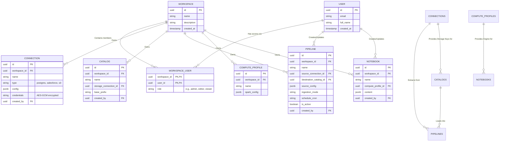

# Platform Entity-Relationship Diagram

This diagram illustrates the database entities of the platform, including the Multi-Tenancy model (`User` and `Workspace`) and how they secure and group the execution resources (`Pipelines`, `Notebooks`, `Connections`, etc.).

