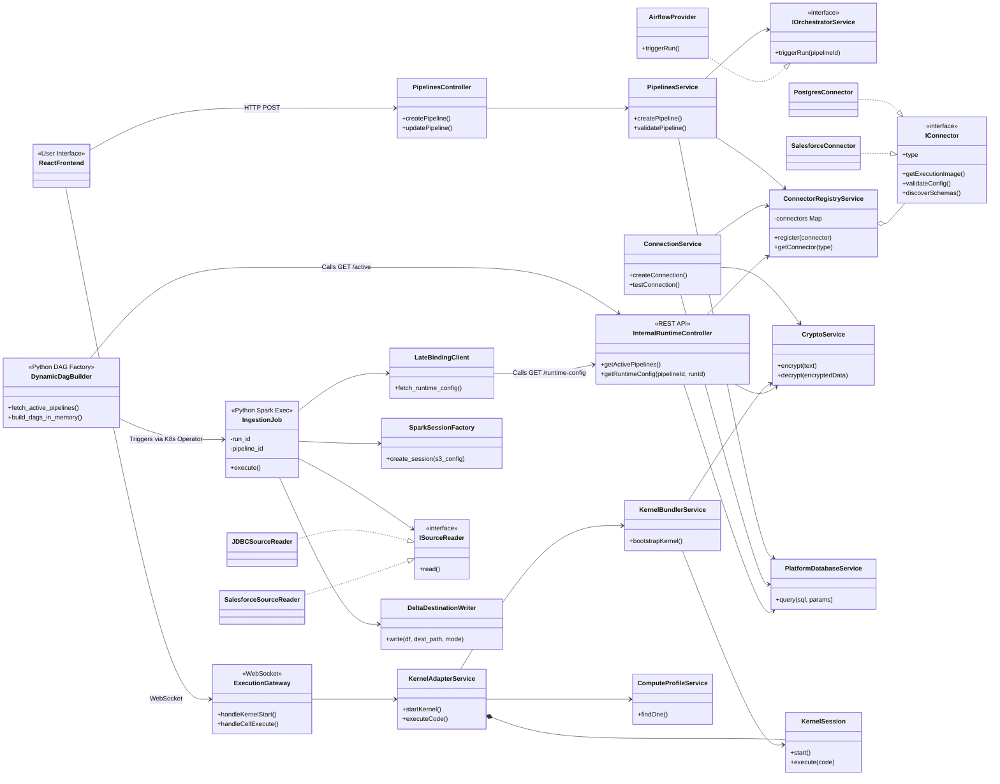

# Master System Class Diagram

This diagram provides a fine-grained, 10,000-foot view of every core class in the Data Platform and how they interact across the network boundaries (Control Plane -> Orchestrator -> Data Plane).

