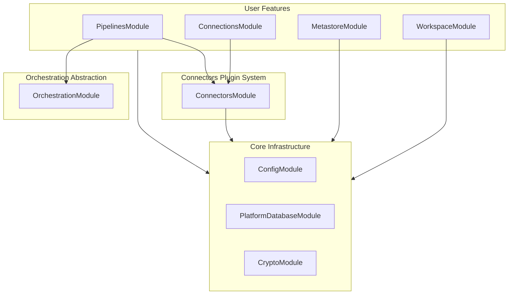
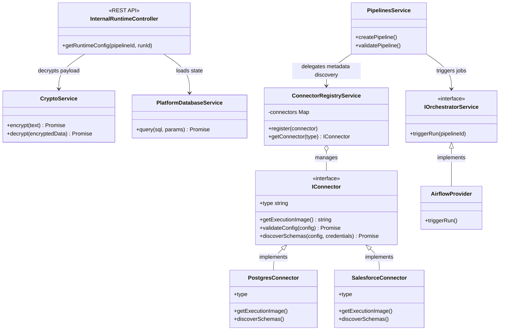

## Part 2: The Control Plane (NestJS Backend)

### 3. NestJS Module Dependency Graph

This diagram shows how the internal NestJS modules depend on each other, proving the strict Domain-Driven Design (DDD) boundaries where features do not tightly couple to specific data source implementations.

---

### 4. Control Plane Class Diagram (Domain-Driven Design)

This diagram details the core TypeScript interfaces and classes in the NestJS application. It highlights the `ConnectorRegistryService` (Plugin Pattern) and the Late-Binding internal API controller.

