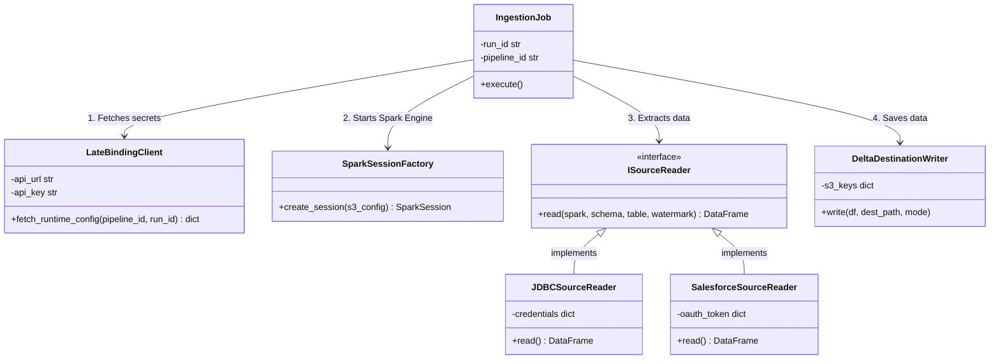

## Part 3: The Data Plane (Spark/Python)

### 5. Data Plane Class Diagram

This diagram illustrates the Object-Oriented Python application running inside the isolated Kubernetes Spark Driver Pods. It enforces a modular plugin pattern for data extraction via `ISourceReader`.

