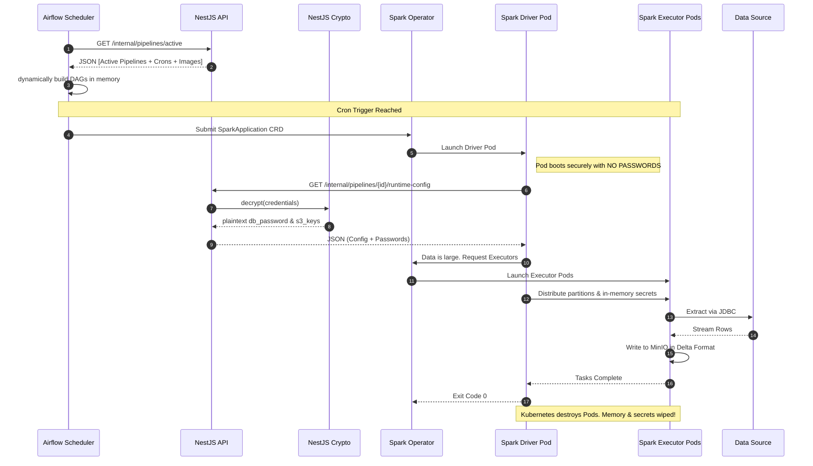
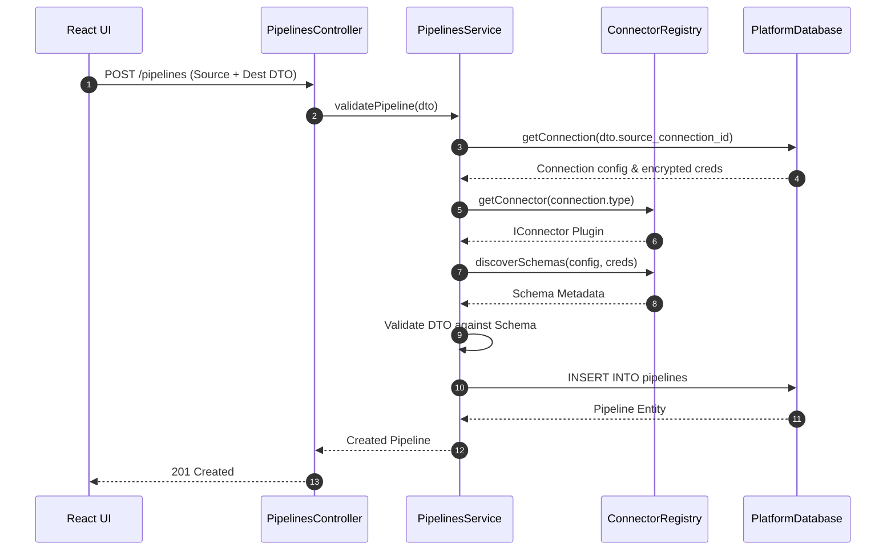
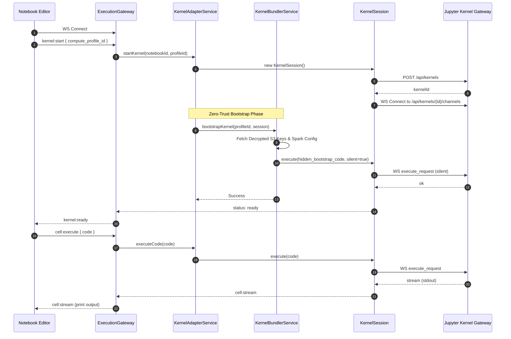

## Part 4: Behavioral Sequence Diagrams

### 6. End-to-End Execution Sequence Diagram

This traces the exact chronological execution flow of a scheduled pipeline, showing how dynamic DAGs are evaluated and how the Kubernetes Spark Driver secures its secrets.

---

### 7. Pipeline Creation & Validation Sequence

This diagram shows how the UI interacts with NestJS to create a pipeline, how the backend validates schemas via the Registry, and how it saves to the database without generating local files.

---

### 8. Notebook & Kernel Execution Sequence

This maps the interactive data science workflow. Notice the crucial "Kernel Bundler" step, which silently injects decrypted MinIO S3 credentials and Spark configurations into the Python kernel before the user is allowed to execute code.

