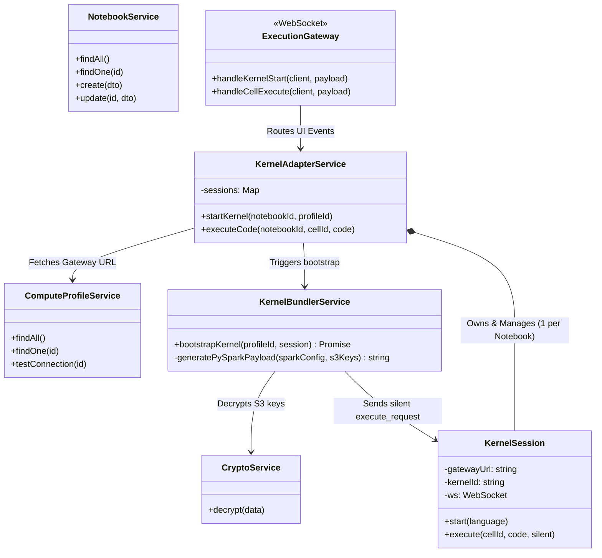

## Part 5: Workspace & Execution (Notebooks)

### 9. Notebooks & Execution Class Diagram

This diagram highlights how the NestJS backend manages the state of Notebooks and Compute Profiles, and how the `ExecutionGateway` proxies live code execution. Crucially, it includes the `KernelBundlerService` which silently injects zero-trust credentials.

