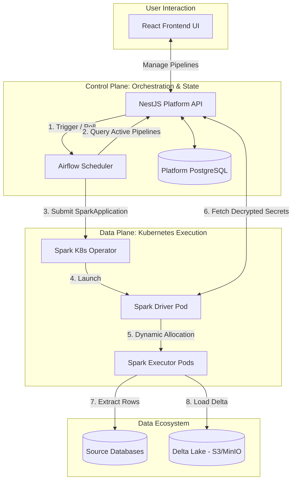
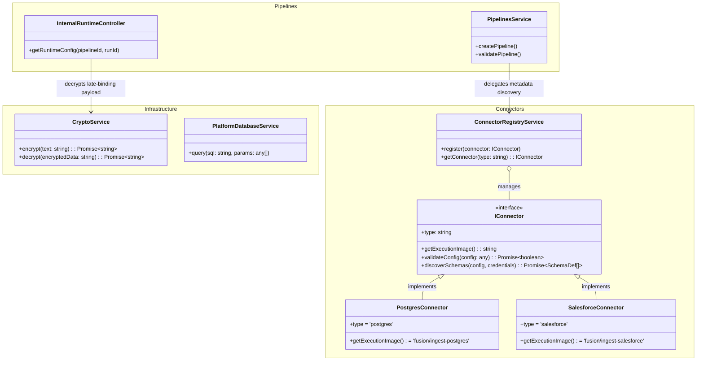
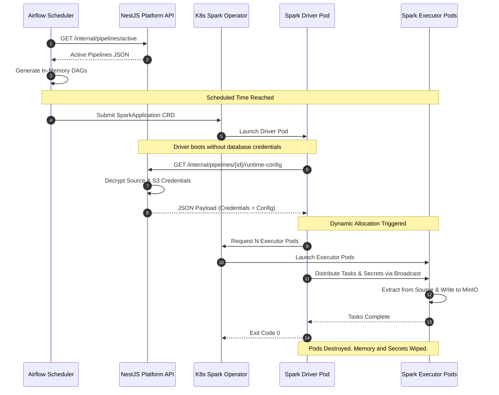

# Target Architecture: Directory Schema & UML Diagrams

## 1. Macro System Architecture (Control Plane vs Data Plane)

This diagram illustrates the absolute highest level of the platform. It separates the "Manager" (Control Plane) from the "Workers" (Data Plane) and shows where the storage layers fit in.

---

## 3. Core Domain Class Diagram

This diagram zooms into the NestJS application to map out the exact TypeScript interfaces and services driving the scalable Connector Pattern and dynamic execution.

---

## 4. Execution Sequence Diagram (Spark on K8s)

This diagram traces a full ingestion run, illustrating how Airflow creates DAGs dynamically, how Kubernetes spawns the Spark Driver, and how the Driver retrieves its zero-trust credentials.

